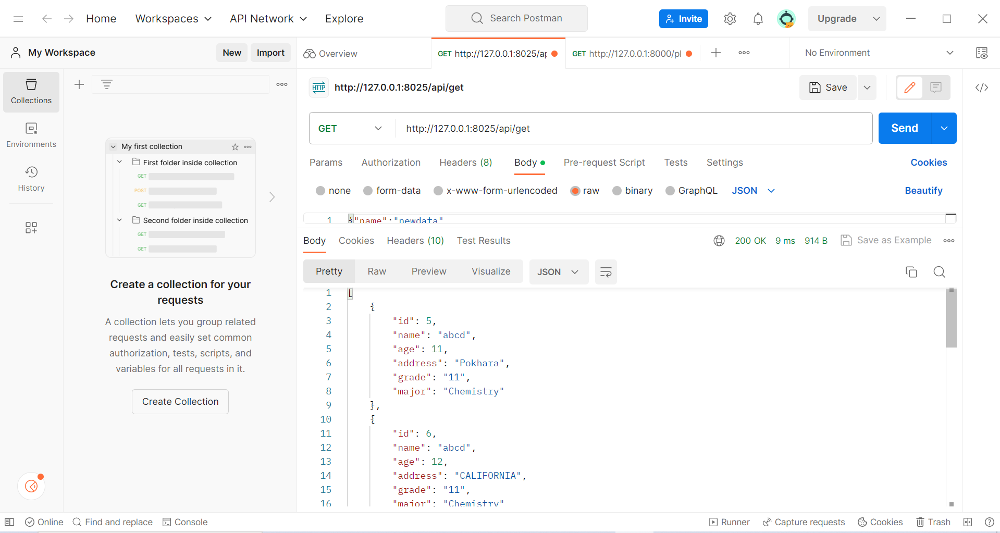
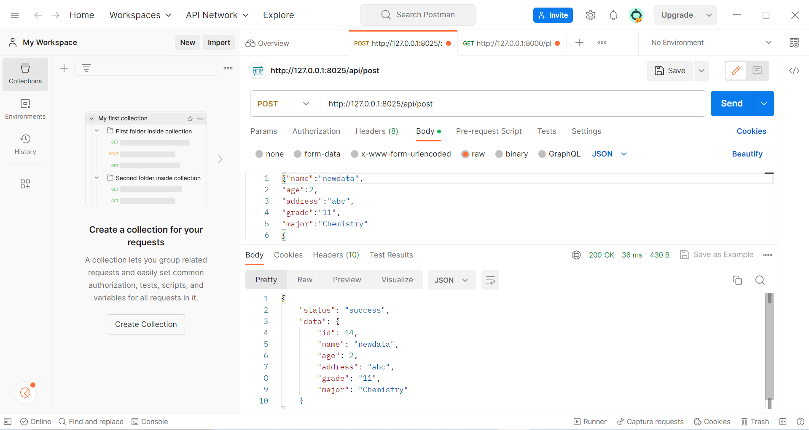
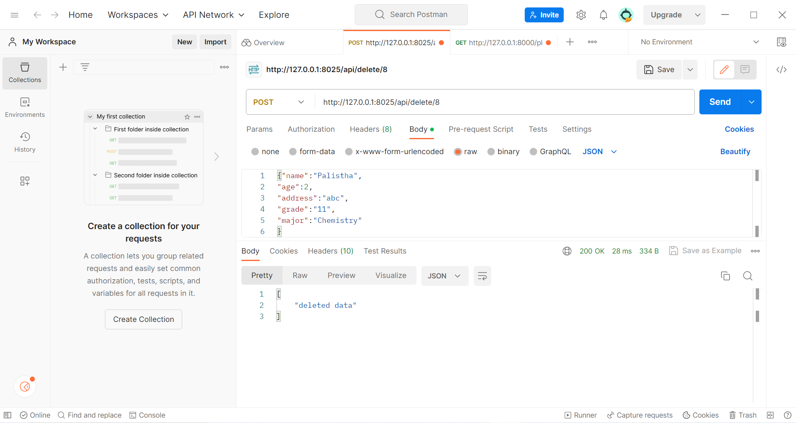

# Task Description
This project is a Django REST API for CRUD operations of student details where the API allows to create, read, update, and delete student records.

## Dependencies
1. Python 3
2. Django
3. Django REST Framework

## Installation
1. Clone the repository
1. Create virtual environment using `python -m venv env`
1. Activate the virtual environment using `source env/Scripts/activate`
1. Install the dependencies by running `pip install -r requirements.txt`
1. Make migrations using `python manage.py makemigrations`
1. Migrate files using `python manage.py migrate` 
1. Run the server using `python manage.py runserver 8025`

## APIs using Django Rest Framework for CRUD operations.
The API provides the following endpoints:

1. http://127.0.0.1:8025/api/get/ : Retrives all the student details

2. http://127.0.0.1:8025/api/post/ : Creates a new student record

3. http://127.0.0.1:8025/api/update/id: Updates the student record of given id

4. http://127.0.0.1:8025/api/delete/id: Delete the student record of given id 

## Implementation Details
This project uses Django REST Framework to create the API. The following steps were taken to create the API:
1. Created a Student model to store student details
2. Created a serializer to convert the Student model to JSON format
3. Created views to handle CRUD operations on the Student model
4. Configured URLs to map the views to their respective endpoints

## CRUD operations using django form
1. http://127.0.0.1:8025: Provides a form to create new student details and redirects to student record page when submit button is clicked. It also contains a link called "Student Record" that redirects to the page containing all the details of student. 
2. http://127.0.0.1:8025/studentdetails : Displays all the record of all students in tabular format. It also contains update/delete options which when clicked takes the id of the specific student for update and delete operations. 
3. http://127.0.0.1:8025/delete/id: Deletes the record of specific student.
4. http://127.0.0.1:8025/update/id: Updates the record of specific student.
